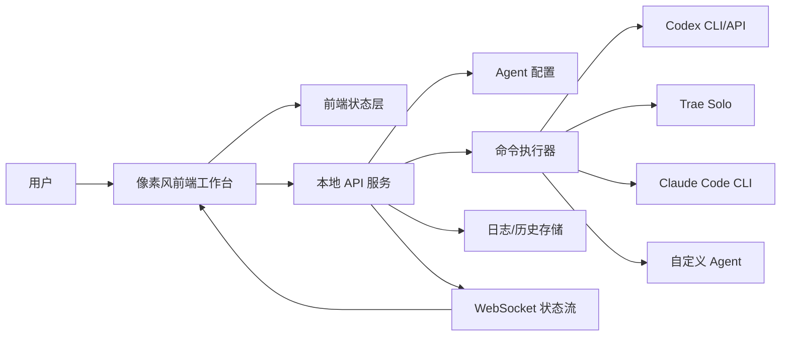

# 像素协作 Coding 小应用规划文档

## 1. 项目定位

本项目暂定名为 **Pixel Coding Hub**。它是一个像素风桌面/网页小应用，用来把 Codex、Trae Solo、Claude Code CLI、以及其他可扩展的 coding agent 连接到同一个可视化工作台中。

它不是简单的聊天聚合器，而是一个“协作编程调度台”：

- 用户可以一键连接多个 coding 工具。
- 每个工具以像素角色、终端节点或工作站的形式呈现。
- 用户可以把一个需求拆成任务，分配给不同 agent。
- 应用展示每个 agent 的状态、当前任务、输出摘要、文件改动和协作关系。
- 后续可以接入真实 CLI/API，让这些工具围绕同一个 repo 协作。

第一阶段目标是做出一个可运行的本地原型：先完成像素风界面、可视化节点、任务分配流程、模拟 agent 状态和命令桥架构。第二阶段再逐步接入真实 Codex、Claude Code CLI、Trae Solo 或其他工具。

## 2. 核心场景

### 2.1 一键连接工具

用户打开应用后，可以看到多个 agent 插槽：

- Codex
- Trae Solo
- Claude Code CLI
- Cursor/Agent
- Gemini CLI
- 自定义 CLI Agent

每个插槽有连接状态：

- 未配置
- 已配置但未连接
- 正在连接
- 在线
- 执行中
- 等待用户确认
- 报错

用户点击“连接”后，应用根据配置执行健康检查，例如：

- CLI 是否存在
- API key 是否可用
- 当前 repo 是否可访问
- 工具是否能执行简单 dry-run

### 2.2 可视化协作 Coding

用户输入一个 coding 目标，例如：

> 给这个 React 项目加一个像素风任务看板，并写测试。

应用会生成或接收一个任务计划：

- 需求理解
- 文件扫描
- UI 实现
- 后端/命令桥实现
- 测试
- review
- commit

用户可以手动或自动把任务分配给不同 agent：

- Codex：负责整体实现与 repo 操作
- Claude Code CLI：负责代码审查或测试补充
- Trae Solo：负责 UI 草图或前端组件

界面上用连线、状态灯、像素动画展示协作进度。

### 2.3 协作日志与产物追踪

应用需要记录：

- 用户目标
- 每个 agent 收到的 prompt
- 每个 agent 的执行状态
- stdout/stderr 或 API 响应摘要
- 改动文件列表
- 测试结果
- 冲突或需要人工介入的地方

日志不是纯终端刷屏，而是分层展示：

- 时间线摘要
- agent 对话流
- 文件改动面板
- 测试面板
- 错误诊断面板

### 2.4 人类控制权

所有高风险操作都必须经过用户确认：

- 写文件
- 删除文件
- git commit
- git push
- 安装依赖
- 运行外部脚本
- 调用联网 API

第一阶段可以先做“确认弹窗 + 模拟操作”，后续再接真实权限系统。

## 3. 产品范围

### 3.1 MVP 功能

MVP 需要包含：

- 像素风单页工作台。
- agent 节点可视化。
- 一键连接模拟流程。
- agent 配置面板。
- 任务输入框。
- 任务拆解看板。
- agent 分配功能。
- 协作时间线。
- 命令桥接口设计。
- 本地 mock 后端。
- 至少 3 个内置 agent：Codex、Trae Solo、Claude Code CLI。
- 美术资产占位方案。

### 3.2 第一阶段不做

为了避免早期过度复杂，第一阶段不做：

- 真正自动合并多个 agent 的代码改动。
- 完整多进程沙箱。
- 远程团队协作。
- 云端账号系统。
- 复杂权限模型。
- 真实支付或商业化功能。
- 插件市场。

### 3.3 后续增强

第二阶段可加入：

- 真实 CLI 执行器。
- 真实工作区 diff 预览。
- agent 间消息传递协议。
- 自动任务拆分。
- 多模型评审。
- 本地 SQLite 历史记录。
- 项目模板。
- Agent profile 导入/导出。
- VS Code/Cursor 深链。
- Obsidian/Notion 协作文档导出。

## 4. 技术栈

### 4.1 前端

推荐技术栈：

- **React 19**
- **TypeScript**
- **Vite**
- **Tailwind CSS**
- **Zustand**：轻量状态管理
- **React Flow**：agent 节点与协作关系可视化
- **Lucide React**：工具栏与状态图标
- **Framer Motion**：轻量动效，可选
- **PixiJS**：如果后续需要更丰富的像素动画或小地图场景

MVP 可以先用 React + CSS 实现像素风，不急着引入 PixiJS。只有当角色动画、地图移动、粒子效果变多时，再引入 PixiJS。

### 4.2 后端

推荐技术栈：

- **Node.js**
- **Fastify** 或 **Express**
- **TypeScript**
- **Zod**：请求与配置校验
- **execa**：安全执行本地 CLI 命令
- **ws** 或 **Socket.IO**：实时状态流
- **SQLite + Drizzle ORM**：后续存储历史记录

MVP 如果只做本地原型，可以先使用 Vite dev server + mock API。等真实命令执行需要独立权限边界时，再拆出后端服务。

### 4.3 桌面化方案

可选方向：

- **Tauri**：更轻、更适合本地工具，Rust 后端可提供更强系统能力。
- **Electron**：生态成熟，Node CLI 调用更直接，但包体更大。
- **Web Localhost App**：第一阶段最简单，直接浏览器打开。

建议路线：

1. 先做 Web Localhost App。
2. 命令桥稳定后迁移到 Tauri。
3. 如果需要高度 Node 生态集成，再评估 Electron。

### 4.4 配置文件

本地配置建议使用：

```json
{
  "agents": [
    {
      "id": "codex",
      "name": "Codex",
      "type": "cli",
      "command": "codex",
      "healthcheckArgs": ["--version"],
      "workingDirectory": "/path/to/project",
      "enabled": true
    }
  ]
}
```

后续可支持：

- 环境变量
- API key 引用
- 项目级配置
- 全局默认配置
- agent 能力声明

## 5. 系统架构

### 5.1 总体架构



### 5.2 前端模块

前端可以拆成：

- `AppShell`：整体布局。
- `TopBar`：项目选择、运行状态、设置入口。
- `AgentDock`：agent 卡片/像素角色列表。
- `CollabMap`：React Flow 协作节点图。
- `TaskBoard`：任务拆分与分配。
- `CommandCenter`：用户输入目标、启动协作。
- `TimelinePanel`：协作日志。
- `DiffPanel`：文件改动摘要。
- `SettingsPanel`：agent 配置。
- `PixelAvatar`：agent 像素角色组件。
- `StatusBadge`：状态显示。

### 5.3 后端模块

后端可以拆成：

- `AgentRegistry`：读取和管理 agent 配置。
- `HealthcheckService`：检测 agent 可用性。
- `TaskPlanner`：任务拆解，第一阶段可 mock。
- `TaskDispatcher`：把任务分发给不同 agent。
- `CommandRunner`：执行本地命令。
- `OutputParser`：解析 stdout/stderr。
- `EventBus`：统一发布状态事件。
- `AuditLogger`：记录执行历史。
- `PermissionGuard`：高风险操作确认。

## 6. 前端设计步骤

### 6.1 信息架构

第一屏直接是工具本体，不做营销页。

布局建议：

- 顶部：当前项目、全局运行状态、设置、主题切换。
- 左侧：agent 列表与连接按钮。
- 中间：协作地图。
- 右侧：任务看板或当前 agent 详情。
- 底部：命令输入与协作日志。

用户打开后应立刻看到：

- 有哪些 coding 工具可以连接。
- 它们现在是什么状态。
- 当前任务流到哪一步。
- 哪些地方需要用户确认。

### 6.2 状态管理

前端状态建议分为：

- `agents`
- `connections`
- `tasks`
- `events`
- `selectedAgentId`
- `selectedTaskId`
- `workspace`
- `uiPreferences`

核心状态示例：

```ts
type AgentStatus =
  | "unconfigured"
  | "offline"
  | "connecting"
  | "online"
  | "working"
  | "waiting"
  | "error";
```

### 6.3 页面步骤

前端开发顺序：

1. 初始化 Vite + React + TypeScript。
2. 建立基础布局。
3. 实现像素风全局样式。
4. 实现 agent 卡片。
5. 实现连接状态流转。
6. 实现协作地图。
7. 实现任务输入框。
8. 实现任务拆分 mock。
9. 实现任务分配到 agent。
10. 实现协作时间线。
11. 实现设置面板。
12. 加入响应式布局。
13. 做浏览器截图验证。

### 6.4 关键交互

#### 连接 Agent

流程：

1. 用户点击某个 agent 的连接按钮。
2. 状态变为 `connecting`。
3. 前端调用 `/api/agents/:id/healthcheck`。
4. 成功后状态变为 `online`。
5. 失败后状态变为 `error`，展示原因。

#### 发起协作任务

流程：

1. 用户输入 coding 目标。
2. 点击启动。
3. 应用生成任务列表。
4. 用户确认或编辑任务。
5. 应用根据 agent 能力建议分配。
6. 用户点击运行。
7. 时间线实时显示事件。

#### 查看 Agent 详情

展示：

- 名称
- 状态
- 能力标签
- 当前任务
- 最近输出
- 配置路径
- 健康检查结果

## 7. 后端设计步骤

### 7.1 API 设计

MVP API：

```txt
GET    /api/agents
POST   /api/agents/:id/healthcheck
POST   /api/tasks/plan
POST   /api/tasks/:id/assign
POST   /api/runs
GET    /api/runs/:id
GET    /api/events
WS     /api/events/stream
```

### 7.2 Agent 配置

每个 agent 应声明：

- id
- name
- provider
- command
- args
- working directory
- healthcheck command
- capabilities
- risk level
- environment variable requirements

能力示例：

```json
{
  "capabilities": [
    "read_files",
    "write_code",
    "run_tests",
    "review_code",
    "git_commit"
  ]
}
```

### 7.3 命令执行器

命令执行器要做：

- 参数白名单。
- 工作目录校验。
- 环境变量隔离。
- stdout/stderr 流式输出。
- timeout。
- exit code 捕获。
- 用户取消。
- 执行前风险评估。

第一阶段先做 mock runner：

- 不真实调用外部 CLI。
- 随机或脚本化返回状态事件。
- 方便先打磨 UI。

第二阶段接真实 runner：

- 使用 `execa`。
- 为每个 agent 定义 adapter。
- 输出通过 WebSocket 推给前端。

### 7.4 Adapter 设计

每种 agent 通过 adapter 接入：

```ts
interface CodingAgentAdapter {
  id: string;
  healthcheck(): Promise<HealthcheckResult>;
  plan?(input: TaskInput): Promise<TaskPlan>;
  run(task: AgentTask): AsyncIterable<AgentEvent>;
  stop(runId: string): Promise<void>;
}
```

内置 adapters：

- `CodexAdapter`
- `ClaudeCodeCliAdapter`
- `TraeSoloAdapter`
- `MockAgentAdapter`
- `CustomCliAdapter`

### 7.5 日志与历史

日志结构：

```ts
type AgentEvent = {
  id: string;
  runId: string;
  agentId: string;
  taskId?: string;
  type: "status" | "stdout" | "stderr" | "file_change" | "test_result" | "approval_request" | "error";
  message: string;
  createdAt: string;
  metadata?: Record<string, unknown>;
};
```

MVP 可先存在前端内存或 JSON 文件里。后续使用 SQLite。

## 8. UI 风格

### 8.1 总体方向

UI 关键词：

- 像素风
- 小型操作台
- 复古终端
- 清晰状态
- 可视化协作
- 低噪音信息密度

它应该像一台“迷你编码控制台”，不是游戏登录页，也不是营销站。

### 8.2 视觉原则

- 主界面以深色像素工作台为主。
- 控件边缘使用 1px 或 2px 硬边框。
- 避免大圆角，卡片圆角控制在 0-4px。
- 用状态灯、像素头像和小动效表达系统状态。
- 文字保持清楚可读，不为了像素感牺牲可用性。
- 不堆叠太多装饰，核心信息优先。

### 8.3 色彩方案

建议不要做单一紫蓝或单一深蓝。可以使用“夜间工作台 + 多色状态灯”：

- 背景：`#101018`
- 面板：`#181824`
- 深面板：`#0b0b12`
- 主文字：`#f4f0d8`
- 次文字：`#9aa0a6`
- 绿色在线：`#57d68d`
- 黄色等待：`#ffd166`
- 红色错误：`#ef476f`
- 蓝色信息：`#4cc9f0`
- 粉色高亮：`#ff70a6`
- 橙色执行中：`#f78c3d`

### 8.4 字体

推荐：

- 英文/代码：`Press Start 2P` 或 `Pixelify Sans`
- 中文：系统黑体 + 像素化标题点缀
- 代码输出：`JetBrains Mono` 或 `SFMono-Regular`

注意：中文大段文本不建议使用强像素字体，容易难读。标题和小标签可以像素化，正文保持清晰。

### 8.5 组件风格

按钮：

- 硬边框。
- 2px 底部阴影模拟像素按键。
- hover 时轻微上移或亮边。
- active 时下压。

面板：

- 使用像素边框。
- 不使用玻璃拟态。
- 不使用大面积渐变。

状态：

- 在线：绿色常亮小灯。
- 执行中：橙色闪烁。
- 等待用户：黄色呼吸。
- 错误：红色短促闪烁。

连线：

- React Flow 线条使用直角线或阶梯线。
- 任务流向用小像素点沿线移动。

## 9. 美术风格

### 9.1 风格定位

美术像素尺寸建议：

- 基础网格：8px。
- 小图标：16x16。
- agent 头像：32x32 或 48x48。
- 场景对象：32x32 到 96x96。
- 背景 tile：16x16 或 32x32。

整体感觉应该是：

- 复古但不幼稚。
- 工具感强。
- 有一点“地下开发室”的氛围。
- 每个 agent 有性格，但不喧宾夺主。

### 9.2 Agent 角色设计

#### Codex

视觉：

- 小型代码机器人。
- 绿色/青色状态眼。
- 背后有迷你终端屏。

气质：

- 稳定、执行、工程化。

动画：

- 在线时眼睛发光。
- 工作时手臂敲键盘。

#### Trae Solo

视觉：

- 像素设计师/前端工匠。
- 带小画板或 UI 网格。
- 颜色可偏粉橙或青蓝。

气质：

- UI、产品、快速原型。

动画：

- 工作时弹出小色块和布局线。

#### Claude Code CLI

视觉：

- 像素终端法师或审稿员形象，但要保持工具感。
- 手持命令行窗口。
- 主色可以是暖白、橙、黑。

气质：

- 推理、审查、重构。

动画：

- 工作时终端字符流动。

#### 自定义 Agent

视觉：

- 空白插槽或像素芯片。
- 用户可选择颜色和图标。

### 9.3 场景资产

MVP 需要的资产：

- `agent-codex-idle.png`
- `agent-codex-working.gif`
- `agent-trae-idle.png`
- `agent-trae-working.gif`
- `agent-claude-idle.png`
- `agent-claude-working.gif`
- `icon-terminal.png`
- `icon-git.png`
- `icon-test.png`
- `icon-warning.png`
- `icon-check.png`
- `tile-grid-dark.png`
- `panel-corner.png`
- `connection-spark.gif`

如果暂时没有手绘资产，可以先用 CSS 像素块实现头像：

- 使用 `box-shadow` 绘制像素头像。
- 或使用 inline SVG，但保持像素硬边。
- 后续再替换成 PNG/GIF。

### 9.4 动效资产

建议动效：

- 连接成功：节点亮起，连线闪过一次。
- agent 工作：头像 2-4 帧循环。
- 任务完成：小 check 图标弹出。
- 报错：节点红色抖动。
- 等待确认：黄色边框闪烁。

动效要短、克制，不能影响阅读日志。

## 10. 数据模型

### 10.1 Agent

```ts
type Agent = {
  id: string;
  name: string;
  kind: "codex" | "trae" | "claude-code-cli" | "custom";
  status: AgentStatus;
  capabilities: AgentCapability[];
  avatar: string;
  command?: string;
  configured: boolean;
};
```

### 10.2 Task

```ts
type Task = {
  id: string;
  title: string;
  description: string;
  status: "todo" | "assigned" | "running" | "blocked" | "done" | "failed";
  assignedAgentId?: string;
  dependencies: string[];
  artifacts: Artifact[];
};
```

### 10.3 Run

```ts
type Run = {
  id: string;
  goal: string;
  status: "planning" | "running" | "waiting" | "done" | "failed" | "cancelled";
  tasks: Task[];
  events: AgentEvent[];
  createdAt: string;
  updatedAt: string;
};
```

### 10.4 Artifact

```ts
type Artifact = {
  id: string;
  type: "file" | "diff" | "test" | "summary" | "log";
  title: string;
  path?: string;
  content?: string;
  createdBy: string;
};
```

## 11. 安全与权限

### 11.1 风险分级

操作分级：

- 低风险：读取配置、健康检查、展示日志。
- 中风险：读取项目文件、运行测试、安装只读分析工具。
- 高风险：写文件、删除文件、执行 shell、安装依赖、git 操作。

### 11.2 用户确认

所有高风险操作弹窗确认：

- 操作类型
- agent 名称
- 目标路径
- 将执行的命令
- 可能影响
- 允许一次或本次 run 内允许

### 11.3 命令限制

真实 CLI 执行时需要：

- 禁止默认 shell 拼接。
- 命令和参数分开传递。
- 工作目录限制在用户选择的 workspace。
- 危险命令提示或阻止。
- 保存完整审计日志。

## 12. 开发里程碑

### 12.1 Milestone 1：静态像素工作台

目标：

- 建立项目。
- 完成布局。
- 完成 agent 卡片。
- 完成 mock 状态。
- 完成基本像素风。

验收：

- 浏览器打开即可看到完整工作台。
- 三个 agent 节点展示正常。
- 响应式不崩。

### 12.2 Milestone 2：可视化协作流程

目标：

- 接入 React Flow。
- 显示 agent 节点和任务节点。
- 点击节点查看详情。
- 模拟任务流转。

验收：

- 用户输入目标后生成任务。
- 任务可分配给 agent。
- 节点状态和时间线同步变化。

### 12.3 Milestone 3：Mock 后端与事件流

目标：

- 添加本地 API。
- 添加 WebSocket 或 SSE 事件流。
- mock agent runner。
- 前端实时显示输出。

验收：

- 点击运行后，时间线持续收到事件。
- agent 状态能从 online 到 working 到 done。

### 12.4 Milestone 4：真实命令桥

目标：

- 添加 CLI adapter。
- 支持 healthcheck。
- 支持 dry-run。
- 支持 stdout/stderr 流。
- 支持取消任务。

验收：

- 能检测本机是否安装 Codex/Claude Code CLI。
- 能执行安全测试命令。
- 错误能展示在 UI 上。

### 12.5 Milestone 5：项目级协作

目标：

- 选择工作目录。
- 读取 git 状态。
- 展示 diff 摘要。
- 运行测试。
- 生成协作报告。

验收：

- 用户能围绕一个 repo 启动协作 run。
- 应用能展示改动文件和测试结果。

## 13. 目录结构建议

```txt
pixel-coding-hub/
  package.json
  vite.config.ts
  tsconfig.json
  src/
    app/
      App.tsx
      routes.tsx
    components/
      agent/
      task/
      timeline/
      layout/
      pixel/
    features/
      agents/
      tasks/
      runs/
      settings/
    lib/
      api.ts
      events.ts
      cn.ts
    styles/
      globals.css
      pixel.css
    assets/
      avatars/
      icons/
      tiles/
  server/
    index.ts
    agents/
    runners/
    services/
    db/
    schemas/
  docs/
    pixel-coding-hub-plan.md
```

如果第一阶段只做前端，可以先不创建 `server/`，把 mock API 放在 `src/features/*/mock.ts`。

## 14. 测试策略

### 14.1 前端测试

- 组件状态测试。
- agent 状态流转测试。
- task 分配逻辑测试。
- 时间线渲染测试。
- 基础可访问性检查。

工具：

- Vitest
- React Testing Library
- Playwright

### 14.2 后端测试

- healthcheck service 测试。
- adapter 测试。
- command runner 参数转义测试。
- 权限拦截测试。
- event stream 测试。

工具：

- Vitest
- Supertest 或 Fastify inject

### 14.3 视觉验证

每个前端里程碑都需要：

- 桌面视口截图。
- 移动视口截图。
- 检查文字不溢出。
- 检查节点不重叠。
- 检查像素资产清晰。

## 15. 后续真实集成思路

### 15.1 Codex

可能集成方式：

- CLI 命令。
- 本地 Codex 桌面会话能力。
- OpenAI API/Agents SDK。

第一步只做：

- `codex --version` 健康检查。
- 用户配置启动命令。
- 将任务 prompt 写入命令参数或 stdin。

### 15.2 Claude Code CLI

可能集成方式：

- `claude` CLI。
- stdout/stderr 事件解析。
- 通过工作目录传入 repo。

第一步只做：

- `claude --version` 健康检查。
- mock run。
- 用户确认后再启用真实执行。

### 15.3 Trae Solo

Trae Solo 的自动化接口需要单独确认。如果没有稳定 CLI/API，可以先作为：

- 手动协作节点。
- 深链打开节点。
- 用户复制 prompt 到 Trae 的桥接面板。
- 后续接入可用协议。

## 16. 美术资产制作流程

### 16.1 MVP 占位资产

先用 CSS/HTML 绘制：

- agent 头像。
- 状态灯。
- 像素边框。
- 背景网格。
- 小图标。

优点：

- 立即可开发。
- 不依赖外部素材。
- 易于换色。

### 16.2 正式资产制作

正式资产可以使用：

- Aseprite
- Pixaki
- Pixelorama
- Photoshop 像素网格
- AI 生成后手工修图

导出规格：

- PNG：静态图标和头像。
- GIF 或 spritesheet：简单动画。
- SVG：仅用于需要动态换色的简洁图标。

### 16.3 资产命名规范

```txt
agent_codex_idle_32.png
agent_codex_working_32_sheet.png
agent_trae_idle_32.png
agent_claude_idle_32.png
icon_status_online_16.png
icon_status_error_16.png
tile_grid_dark_16.png
fx_connection_spark_16_sheet.png
```

## 17. 交付物清单

第一阶段交付：

- 可运行前端原型。
- mock agent 数据。
- 像素风 UI 样式。
- 可视化协作地图。
- 任务分配流程。
- 协作日志。
- 设置面板。
- 命令桥接口文档。
- 美术资产清单。

第二阶段交付：

- 本地后端服务。
- CLI healthcheck。
- mock runner 替换为真实 runner。
- WebSocket 实时输出。
- 权限确认系统。
- 执行历史记录。

第三阶段交付：

- 多 agent 协作策略。
- diff 与测试结果面板。
- repo 工作区集成。
- 项目报告导出。
- 桌面应用封装。

## 18. 推荐实施顺序

建议按这个顺序开工：

1. 先做纯前端像素工作台。
2. 用 mock 数据把完整体验跑通。
3. 加 React Flow，完成协作可视化。
4. 把 mock 状态改成事件流。
5. 加本地后端。
6. 先接 healthcheck，不急着真实执行任务。
7. 加权限确认。
8. 接入一个真实 CLI。
9. 做文件改动与测试结果面板。
10. 最后做桌面化。

## 19. 关键风险

### 19.1 多 Agent 写同一份代码的冲突

风险：

- 多个 agent 同时改同一文件。
- 输出互相覆盖。
- git 状态混乱。

缓解：

- MVP 不允许并发真实写入。
- 每个 agent run 使用独立 branch 或 worktree。
- 合并前展示 diff。
- 用户确认后再应用。

### 19.2 CLI 自动化能力不一致

风险：

- 有些工具没有 CLI。
- 有些 CLI 不适合非交互调用。
- 输出格式不稳定。

缓解：

- 使用 adapter 层隔离差异。
- 支持手动节点。
- 支持 copy prompt。
- 支持只做 healthcheck 和深链打开。

### 19.3 UI 信息过载

风险：

- 日志、节点、任务、diff 同时出现会混乱。

缓解：

- 默认展示摘要。
- 详情放在侧边栏。
- 时间线可过滤。
- 任务和 agent 状态优先。

### 19.4 权限与安全

风险：

- 命令执行会影响本地文件。

缓解：

- 明确风险等级。
- 默认 mock。
- 高风险操作确认。
- 命令参数分离。
- 保存审计日志。

## 20. MVP 成功标准

MVP 成功不是“真的让所有 agent 自动写代码”，而是：

- 用户一眼能理解多个 coding agent 正在如何协作。
- 用户能输入一个目标，看到任务拆分与分配。
- 用户能看到每个 agent 的状态和输出。
- 应用结构已经为真实 CLI/API 接入留好位置。
- 像素风足够鲜明，但仍然是好用的工程工具。

当这个原型跑通后，再接真实命令桥就会非常自然。
